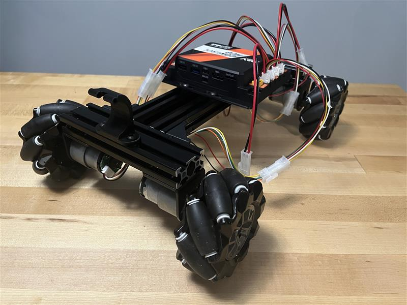

## susBot: a very sus robot for First Tech Challenge training

This repo contains documentation and code for an inexpensive, but very sus, robot that can be used for First Tech Challenge training.

### Robot Chassis

- MC400 Mechanum Chassis (link: [amazon](https://www.amazon.com/dp/B09KLCF1D3)) comes with
  - Chassis constructed with 2020 T Slot
  - 4x JGB37-520 motor with hall effect encoder
  - 4x 97mm mechanum wheels
- Logitech C270 webcam (link: [amazon](https://www.amazon.com/Logitech-Desktop-Widescreen-Calling-Recording/dp/B004FHO5Y6))
- 2020 M5 T-slot nuts (link: [amazon](https://www.amazon.com/dp/B0DMCS8KW4))

### Wiring Harness

Pigtail connectors:
- 2pos JST-VH 3.96mm (link: [amazon](https://www.amazon.com/dp/B07FM5J96B))
- 4pos JST-PH (link: [amazon](https://www.amazon.com/dp/B07NRBKN6N))
- 6pos JST-XH (link: [amazon](https://www.amazon.com/dp/B0D3LV6X3Y))

Mini Fit Jr:
- 2pos for Motors
  - 39-01-3023 2pos plug (link: [digikey](https://www.digikey.com/en/products/detail/molex/0039013023/447277))
  - 39-01-2020 2pos receptacle (link: [digikey](https://www.digikey.com/en/products/detail/molex/0039012020/61315))
- 4pos for Encoders
  - 39-01-3043 4pos plug (link: [digikey](https://www.digikey.com/en/products/detail/molex/0039013043/1118561))
  - 39-01-2040 4pos receptacle (link: [digikey](https://www.digikey.com/en/products/detail/molex/0039012040/61376))
- Crimps
  - 39-00-0041 18-24awg pin (link: [digikey](https://www.digikey.com/en/products/detail/molex/0039000041/61445))
  - 39-00-0039 18-24awg socket (link: [digikey](https://www.digikey.com/en/products/detail/molex/0039000039/61448))
  - 39-00-0047 22-28awg pin (link: [digikey](https://www.digikey.com/en/products/detail/molex/0039000049/61451))
  - 39-00-0049 22-28awg socket (link: [digikey](https://www.digikey.com/en/products/detail/molex/0039000047/61454))
