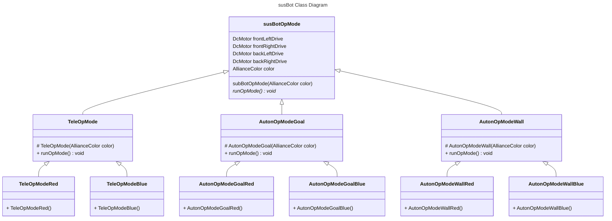

## susBot Software Design

```mermaid
---
title: susBot Class Diagram
---
classDiagram
    class susBotOpMode {
        DcMotor frontLeftDrive
        DcMotor frontRightDrive
        DcMotor backLeftDrive
        DcMotor backRightDrive
        AllianceColor color

        subBotOpMode(AllianceColor color)
        runOpMode() void*
    }

    susBotOpMode <|-- TeleOpMode
    class TeleOpMode{
        # TeleOpMode(AllianceColor color)
        + runOpMode() void
    }

    TeleOpMode <|-- TeleOpModeRed
    class TeleOpModeRed {
        + TeleOpModeRed()
    }

    TeleOpMode <|-- TeleOpModeBlue
    class TeleOpModeBlue {
        + TeleOpModeBlue()
    }

    susBotOpMode <|-- AutonOpModeGoal
    class AutonOpModeGoal {
        # AutonOpModeGoal(AllianceColor color)
        + runOpMode() void
    }

    AutonOpModeGoal <|-- AutonOpModeGoalRed
    class AutonOpModeGoalRed {
        + AutonOpModeGoalRed()
    }

    AutonOpModeGoal <|-- AutonOpModeGoalBlue
    class AutonOpModeGoalBlue {
        + AutonOpModeGoalBlue()
    }

    susBotOpMode <|-- AutonOpModeWall
    class AutonOpModeWall {
        # AutonOpModeWall(AllianceColor color)
        + runOpMode() void
    }

    AutonOpModeWall <|-- AutonOpModeWallRed
    class AutonOpModeWallRed {
        + AutonOpModeWallRed()
    }

    AutonOpModeWall <|-- AutonOpModeWallBlue
    class AutonOpModeWallBlue {
        + AutonOpModeWallBlue()
    }

```